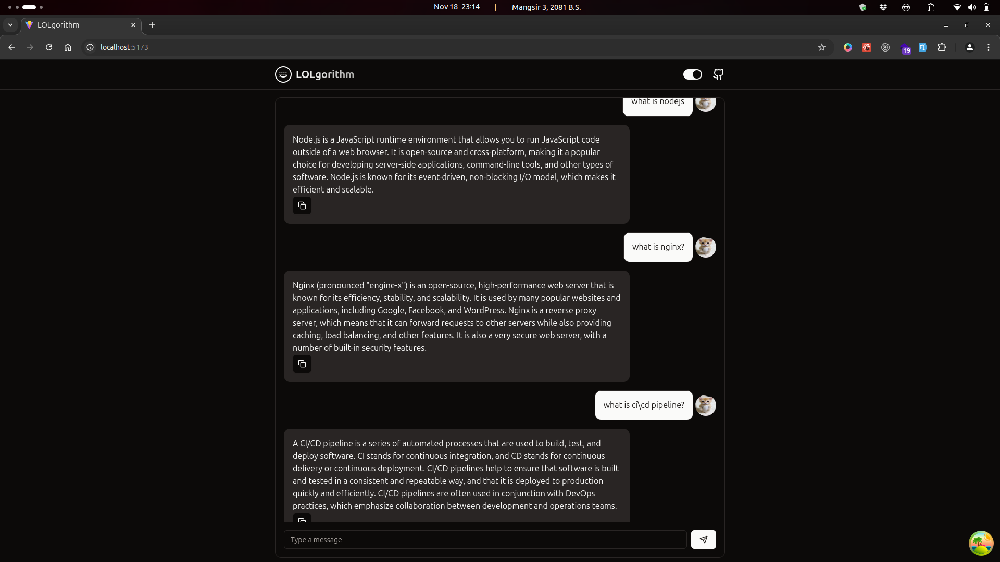

# LOLgorithm Chat - AI Chat Interface



A modern chat interface powered by Google's Gemini AI, built with React, TypeScript, and Tailwind CSS.

## 🌟 Features

- 🤖 Real-time AI chat powered by Google's Gemini AI
- 🎨 Clean and modern UI with dark/light mode support
- 💾 Persistent chat history using local storage
- ⚡ Fast and responsive interface
- 🔄 Automatic retry mechanism for failed requests
- 🛡️ Error handling and rate limiting
- 📱 Fully responsive design

## 🛠️ Tech Stack

- React 18
- TypeScript
- TanStack Query (React Query)
- Tailwind CSS
- Radix UI Components
- Google Gemini AI API
- Vite

## 🚀 Getting Started

### Prerequisites

- Node.js 16.x or later
- npm or yarn
- Google Gemini API key

### Installation

1. Clone the repository:
```bash
git clone https://github.com/f0rsakeN-afk/LOLgorithm
cd lolgorithm-chat
```

2. Install dependencies:
```bash
npm install
# or
yarn install
```

3. Create a `.env` file in the root directory:
```env
VITE_GOOGLE_GEMINI_API_KEY=your_api_key_here
```

4. Start the development server:
```bash
npm run dev
# or
yarn dev
```

## 🔧 Configuration

The application can be configured through various constants and environment variables:

### Environment Variables

- `VITE_GOOGLE_GEMINI_API_KEY`: Your Google Gemini API key

### Chat Configuration (`src/config/index.ts`)

```typescript
export const CHAT_CONFIG = {
  MAX_MESSAGE_LENGTH: 4000,
  MAX_CONTEXT_MESSAGES: 5,
  RETRY_COUNT: 3,
  RETRY_DELAY: 1000,
  RATE_LIMIT: {
    MAX_REQUESTS: 10,
    TIME_WINDOW: 60000, // 1 minute
  },
};
```


## 🔨 Development

### Available Scripts

- `npm run dev`: Start development server
- `npm run build`: Build for production
- `npm run lint`: Run ESLint
- `npm run preview`: Preview production build

### Code Style

This project uses:
- ESLint for code linting
- Prettier for code formatting
- TypeScript for type checking

## 🌐 API Usage

The application uses Google's Gemini AI API for chat functionality. API calls are made with:
- Automatic retry mechanism
- Rate limiting
- Error handling
- Request caching


## Demo


## 🤝 Contributing

1. Fork the repository
2. Create your feature branch (`git checkout -b feature/AmazingFeature`)
3. Commit your changes (`git commit -m 'Add some AmazingFeature'`)
4. Push to the branch (`git push origin feature/AmazingFeature`)
5. Open a Pull Request


---
Made with ❤️ by Naresh Rajbanshi